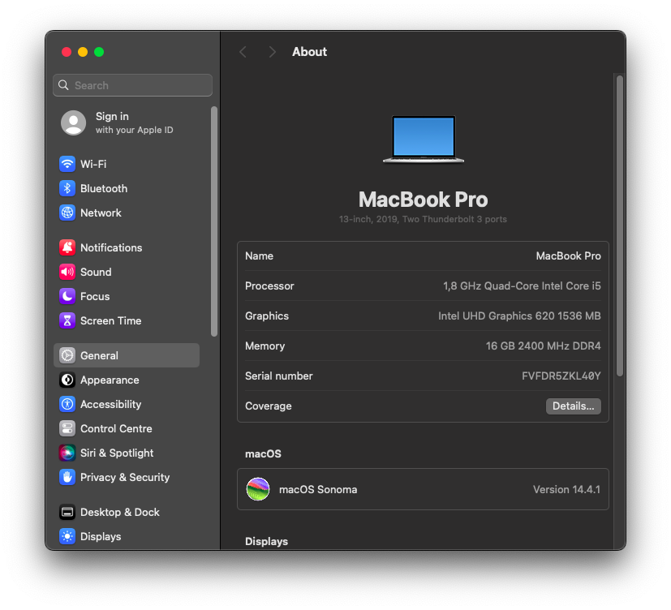

# Lenovo ThinkPad E580 OpenCore configuration for macOS Sonoma
This is my final attempt at hackintoshing this laptop before Apple completely phases out Intel based MacBooks.

## Key specifications

| Component | Model |
| --------- | ----- |
| **CPU** | Intel Core i5-8250U |
| **GPU** | Intel UHD 620 |
| **ETHERNET** | Realtek 8111GUS |
| **AUDIO** | Conexant CX20753 |
| **Touch Pad** | Synaptics TM3383-032 |
| **TrackPoint** | TPPS/2 Elan |
| **Keyboard** | PS2 |

## Compatibility checklist
- [x] Audio (bluetooth, headphone jack and HDMI)
- [x] Camera
- [x] USB 
- [x] Full Gesture Support
- [x] Ethernet
- [x] WiFi
- [x] iServices (make sure you have unique SMBIOS generated)
- [x] Sleep
- [x] HDMI out
- [x] Power Management
- [x] Bluetooth
- [x] Incremental and major updates (tested with security updates and upgrade from Ventura to Sonoma via the system updater)

### Not working
- Fingerprint (unfixable)
- SD card reader
- Function keys not working after sleep, specific to Edge series, needs further ACPI patching. This can be worked around using karabiner.

### Notes
This configuration has been put together with Intel wireless card in mind, I recommend getting a natively supported card for better experience OOTB.
For list of supported cards, please see [buyer's guide](https://dortania.github.io/Wireless-Buyers-Guide/)

- I chose AirportItlwm (the reverse engineered one) instead of itlwm for a more seamless experience, for daily usage it is stable enough, also it allows you to use WiFi in macOS setup.
- As of writing this, on macOS Sonoma you cannot use 5 GHz networks with WPA3 encryption, it will connect but you will have no internet connection.
- AirportItlwm is tied to specific major release of macOS, if you plan on using anything else than macOS Sonoma, get the correct version of the kext.

## OpenCore Configuration

**[OpenCorePkg](https://github.com/acidanthera/OpenCorePkg)** (0.9.9) - the base EFI structure

### config.plist
Generate SMBIOS for `MacBookPro15,4` (Generate with [GenSMBIOS](https://github.com/corpnewt/GenSMBIOS)), `MacBookPro14,1` SMBIOS is not supported by macOS Sonoma

 ### Drivers

* Removed
   - Everything except `OpenRuntime.efi` and `OpenCanopy.efi` - _We don't need the rest at all (legacy drivers)_
   
* Added
   - [HfsPlus.efi](https://github.com/acidanthera/OcBinaryData/blob/master/Drivers/HfsPlus.efi) - Required to be able to see HFS volumes, OC already ships with its opensource variant `OpenHfsPlus.efi` which is quite experimental and approximately 3 times slower than its proprietary counterpart and is yet to undergo security audit

## Preparations

### Creating the USB installer

Go see this detailed guide: <https://dortania.github.io/OpenCore-Desktop-Guide/installer-guide/>
